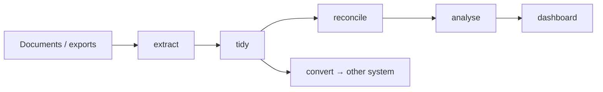
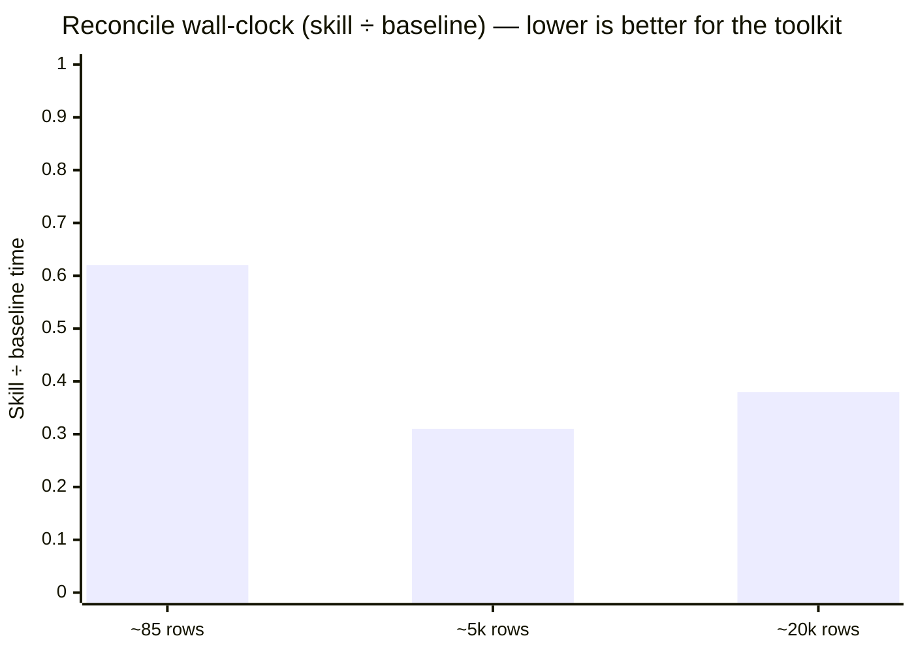

# Data Toolkit

You know the file. `Q4_sales_FINAL_v3(2).xlsx` — three header rows, a "Total" row
hiding in the middle, dates in four formats, amounts in two currencies (one of them
just `$`, good luck), and a column someone typed "pending" into. Somebody needs the
real numbers by 4pm.

**Data Toolkit is the fix.** It turns messy business data into clean, reconciled,
analysed, presentable outputs — every number computed by a deterministic engine that
runs on your own machine.

Six skills. Five make one arc — **extract → tidy → reconcile → analyse → visualise** — and
**convert** re-expresses clean data in another system's format. Use one, or chain them.

Built for the people who spend their week wrestling exports into shape — accountants,
bookkeepers, finance and ops analysts, consultants, and the firms that serve them —
and for anyone who needs the numbers **right, reproducible, and confidential**, not
just fast.

> **Same task. Toolkit vs. plain Python.** On a reproducible **two-model** benchmark, a strong
> model (Claude Sonnet 5) matched the toolkit's numbers by hand at small sizes — then the toolkit
> pulled ahead on two axes: **as the data grew** (from ~5,000 rows/side, ~3× faster and flat-cost)
> and **as the model got cheaper** (on Claude Haiku 4.5 the plain-Python arm blended currencies
> into a **£1.1M** wrong total; the skill arm's currency gate held). Full write-up in
> [`benchmark/`](benchmark/).

**From [Phronesis Applied](https://www.phronesis-applied.com)** — practical AI and
automation for real businesses. The open front door of the Phronesis Applied finance
toolkit suite.

**Skip the pitch — open a sample:**
[`sample-dashboard.html`](examples/sample-dashboard.html) ·
[`sample-branded-dashboard.html`](examples/sample-branded-dashboard.html)
(Acme Co white-label) ·
[`sample-reconciliation.xlsx`](examples/sample-reconciliation.xlsx)

New here? Start with [`ONBOARDING.md`](ONBOARDING.md) — install, quickstart, then
**theme + logo** in one sitting.

---

## Install (Claude Code plugin)

In an interactive Claude Code session:

```
/plugin marketplace add moonlight-lupin/data-toolkit
/plugin install data-toolkit@data-toolkit
```

That’s it. The six skills light up and trigger when you describe the job
("analyse this export", "reconcile these two files"). No config, no keys.

**Letting an agent do it.** Ask Claude Code to
*"install the data-toolkit plugin from `moonlight-lupin/data-toolkit`"* — it will run:

```bash
claude plugin marketplace add moonlight-lupin/data-toolkit
claude plugin install data-toolkit@data-toolkit
```

The repo is its own marketplace (`.claude-plugin/marketplace.json`), so `owner/repo`
is all either form needs. Prefer scripts over the plugin? Clone the repo and skip to
[Getting started](#getting-started) — the toolkit is happily standalone.

## Try it in ~10 minutes

No Claude required:

```bash
pip install openpyxl
python examples/run_quickstart.py          # neutral default dashboard
python examples/run_branded_dashboard.py   # same data, Acme Co theme + logo
```

That writes working papers and HTML dashboards under `examples/out/`. Full notes:
[`examples/README.md`](examples/README.md). Step-by-step (incl. theme + logo):
[`ONBOARDING.md`](ONBOARDING.md).

## Why teams choose it

- **Local engine, no third-party services.** No network calls, no cloud OCR, no CDN,
  no credentials, no connectors. Shared drives (SharePoint / OneDrive / Drive) are
  read as synced local paths, so nothing is pushed through a cloud connector. And to
  be straight about the limit: an AI agent drives these skills, so whatever it reads
  into its context goes to your AI provider — we don't claim "it never left." What we
  do claim: the processing is local, no *third party* beyond the provider you already
  chose sees your data, and because the engine does the heavy lifting the agent works
  with samples and summaries rather than streaming whole datasets through the model.
  See [`DATA-HANDLING.md`](DATA-HANDLING.md).
- **Numbers you can defend.** Every transform and every quoted figure is computed by
  a deterministic engine (exact `Decimal`, currency-aware, dates normalised) and
  logged — not free-typed by a model having a creative afternoon. Money doesn’t
  drift, `100 USD ≠ 100 SGD`, and each run leaves an audit trail a reviewer can
  follow.
- **Flat cost when the file gets serious.** On the same reconciliation at ~85 →
  ~5,000 → ~20,000 rows/side, skill wall-clock stayed ~flat while hand-rolled Python
  got slower and riskier. Recurring / high-volume work is where the toolkit stops
  being “nice” and starts being cheaper. See [Benchmark](#benchmark).
- **Drafts, not advice.** Every output is a first draft for a qualified person to
  sign off — clearly labelled, never dressed up as a decision or as financial / tax /
  investment advice. See [`PRINCIPLES.md`](PRINCIPLES.md).
- **White-label ready.** Ships unbranded — a neutral default; pass a `theme` dict
  (brand name, colours, fonts, local logo) to re-skin dashboards. See
  [Onboarding §3](ONBOARDING.md#3-put-your-brand-on-a-dashboard-theme--logo).
- **Standalone.** Plain Python plus optional libraries for non-spreadsheet inputs. It
  also slots in as a data-prep front end for the rest of the Phronesis Applied suite,
  but depends on none of them.

## When it shines

| Situation | What to expect |
|---|---|
| Small one-off file, strong model, careful prompt | Correctness parity — you’re buying standardised artefacts and an audit trail, not magic arithmetic |
| Recurring exports, multi-thousand-row reconciles, reviewable working papers | Cheaper, faster, flatter cost — and a smaller error surface than hand-rolled agent code |
| Client / financial data that must not reach third-party services | Local engine by design — no cloud OCR, no connectors, no uploads (your own AI provider still sees what the agent reads) |
| Stakeholder one-pager by end of day | Brandable HTML dashboard → browser → print to PDF |

## What you can do



Use one skill on its own, or chain them — each hands the next a clean `.xlsx`.

| You need to… | Skill | You get |
|---|---|---|
| Get structured data **out of documents** (PDFs incl. multi-table & scanned, Word, Outlook `.msg`) | **data-extract** | a clean `.xlsx` + audit report — form (label → value) and table modes, local OCR for scans |
| **Tidy** a junk-filled export, pasted table or PDF table into a validated table | **data-tidy** | a structured, validated `.xlsx` + change/audit report — profiles the mess, proposes a transform, you confirm, it applies deterministically |
| **Reconcile** two record sets (bank vs ledger, invoice vs statement) | **data-reconcile** | a reconciliation working paper (`.xlsx`) — match on a key or amount + date; every unmatched item triaged; currency-aware; Debit/Credit, sign flips, ageing, GST hints; never force-fits, never posts |
| **Analyse** a dataset and find what actually matters | **data-analyse** | an insight brief — headline findings, metrics for the data type (trends, concentration, outliers, ageing), honest caveats; engine computes, narrative only interprets |
| **Present** the numbers to a stakeholder | **data-visualise** | a self-contained, brandable HTML dashboard (KPI cards, SVG charts, heatmap / sparkline / waterfall, RAG tables) — any browser, print to PDF, live Artifact in Cowork / Claude.ai — **or** an Excel chart workbook (`.xlsx`, native editable charts) when the reader wants to poke at the numbers |
| **Convert** a clean dataset to another system's format, or reshape it | **data-convert** | the target file (CSV / JSON / XLSX / fixed-width, or a filled template) + a reusable conversion card — maps onto an import **contract** (flags unmapped / required-missing, validates), reshapes (long↔wide, nested JSON↔flat, split, merge), enriches via lookup; deterministic, never invents |

**A typical run:** scanned remittance PDF → `data-extract` → `data-tidy` →
`data-reconcile` against the ledger → `data-analyse` for the exceptions →
`data-visualise` one-pager for the controller. Or jump in mid-arc with data you
already have.

## Benchmark

The honest comparison: **the same model with the toolkit vs. with plain Python**,
across all six skills, a reconciliation **scaling** test, and a recurring-conversion
test — now on **two model tiers**. Synthetic fixtures, planted traps, recorded ground
truth; every deliverable scored by independent verification, not the agents’ self-reports.

**It isn’t “better arithmetic.”** On a strong model (Sonnet 5) a well-prompted baseline
matched the toolkit’s headline numbers. The value shows up on two axes — and it *compounds*:

**As the data grows → cheaper and faster.** The engine’s cost stays flat while hand-rolled
matching gets slower *and* riskier (it force-paired unrelated rows; shipped a formula bug in a
delivered workbook — the failure class a tested engine removes).



| Reconciliation, rows/side | Skill ÷ baseline time | What happened |
|---|---|---|
| ~85 | 0.62 | Already faster; token spend near parity |
| ~5,000 | **0.31** | ~3× faster; ~25% fewer tokens |
| ~20,000 | **0.38** | Still ~2.6× faster; skill cost stays flat |

**As the model gets cheaper → correctness.** Re-run on **Haiku 4.5** (a small, cheap model), the
plain-Python arm fell into a planted trap and headlined a blended **£1,121,085** — GBP + USD added
with no exchange rate. The skill arm’s currency gate held. The gap between arms **widens** (50 vs
**44** on Haiku, vs 50 vs 48.5 on Sonnet), while skill overhead nearly vanishes (**+14% tokens**,
vs +45%). *Haiku + skills ≈ Sonnet-quality artefacts at a fraction of the cost.*

And **recurring conversion repeats cheaply and safely** — month 2+ costs ~1 minute, and on a
drifted month the toolkit **excluded the bad row** to exact ground truth where the hand-rolled
baseline **halted the whole run**. Issues surfaced by testing were filed and fixed upstream, then
re-verified — inside the benchmark.

Both full reports (Sonnet + Haiku), per-task scores, cost tables and honest limits (**n = 1** per
cell; on a weak model *at scale* the risk shifts to correctness — see the limits) live in
**[`benchmark/`](benchmark/)**.

## Under the hood

One local engine in **`scripts/`**: `ingest.py` (CSV / multi-sheet `.xlsx` / PDF /
`.docx` / `.msg` / pasted text), `dataclean.py` (deterministic normalisation + change
log), `extract.py` (field/table location), `envcheck.py` (capability probe).
`data-analyse` adds a metrics engine; `data-visualise` renders with pure stdlib
HTML/SVG — no charting library, no CDN, no remote fetches.

## Getting started

Requirements stay light:

- **Python 3** + **`openpyxl`** — the one hard dependency (`.xlsx` I/O).
- Optional, only for the inputs you use: **PyMuPDF** (PDF), **pdfplumber** (messy /
  borderless PDF tables), **python-docx**, **extract_msg**, local **Tesseract** for
  scanned-document OCR. Each degrades gracefully when absent.
- `data-visualise` needs no third-party library to render; a browser is only for
  preview / print to PDF.

```
python scripts/envcheck.py
```

Per-skill mode/environment matrix: [`COMPATIBILITY.md`](COMPATIBILITY.md).

## Trust & quality

```
python bin/data-lint            # manifests, descriptions & engine self-tests
python tests/test_engine.py     # regression suite — standalone, no pytest needed
```

`bin/data-lint` is the authoring gate. The regression suite locks the highest-risk
behaviours: exact `Decimal` amounts, currency comparison, reconciliation date window,
multi-sheet selection, form-layout extraction, PDF engine scoring. See
[`tests/README.md`](tests/README.md). GitHub Actions runs lint + suite + quickstart
smoke on every push/PR to `main`.

## Contributing & security

- Setup, checks, PRs: [`CONTRIBUTING.md`](CONTRIBUTING.md)
- Vulnerabilities: [`SECURITY.md`](SECURITY.md)
- Behaviour / data rules: [`PRINCIPLES.md`](PRINCIPLES.md), [`DATA-HANDLING.md`](DATA-HANDLING.md)

## License

[Apache License 2.0](LICENSE) — use it, fork it, build on it, commercially or
otherwise. See [`NOTICE`](NOTICE) for attribution and brand-mark notes.

---

Built and maintained by **[Phronesis Applied](https://www.phronesis-applied.com)** ·
Singapore · [hello@phronesis-applied.com](mailto:hello@phronesis-applied.com)
