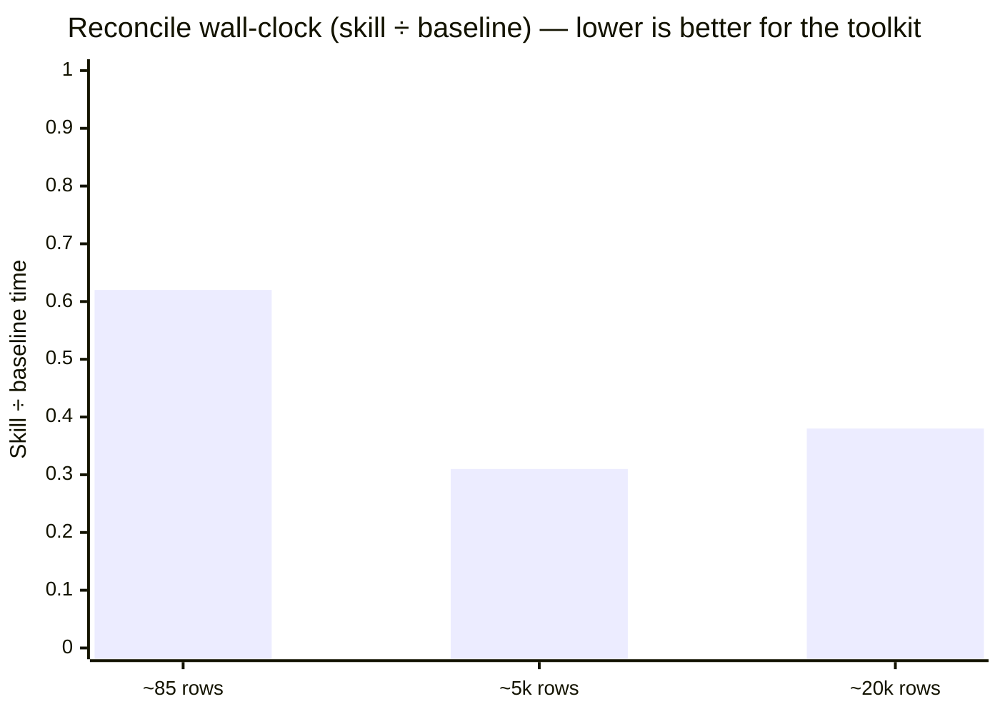

# Data Toolkit

You know the file. `Q4_sales_FINAL_v3(2).xlsx` — three header rows, a "Total" row
hiding in the middle, dates in four formats, amounts in two currencies (one of them
just `$`, good luck), and a column someone typed "pending" into. Somebody needs the
real numbers by 4pm.

**Data Toolkit is the fix.** It turns messy business data into clean, reconciled,
analysed, presentable outputs — entirely on your own machine, nothing uploaded.

Five skills, one arc: **extract → tidy → reconcile → analyse → visualise.** Use one,
or chain them. Each hands the next a clean `.xlsx`.

Built for the people who spend their week wrestling exports into shape — accountants,
bookkeepers, finance and ops analysts, consultants, and the firms that serve them —
and for anyone who needs the numbers **right, reproducible, and confidential**, not
just fast.

> **Same model. Two paths. Different ending.** On a reproducible benchmark, Claude
> Sonnet 5 with this toolkit matched plain-Python Sonnet on the headline numbers —
> then pulled away as the data grew: at ~5,000 rows/side, **~3× faster**, cheaper on
> tokens, and without the baseline’s growing error surface (force-paired near-misses,
> a formula bug in a delivered workbook). Full write-up in
> [`benchmark/`](benchmark/).

**From [Phronesis Applied](https://www.phronesis-applied.com)** — practical AI and
automation for real businesses. The open front door of the Phronesis Applied finance
toolkit suite.

**Skip the pitch — open a sample:**
[`sample-dashboard.html`](examples/sample-dashboard.html) ·
[`sample-branded-dashboard.html`](examples/sample-branded-dashboard.html)
(Acme Co white-label) ·
[`sample-reconciliation.xlsx`](examples/sample-reconciliation.xlsx)

New here? Start with [`ONBOARDING.md`](ONBOARDING.md) — install, quickstart, then
**theme + logo** in one sitting.

---

## Install (Claude Code plugin)

In an interactive Claude Code session:

```
/plugin marketplace add moonlight-lupin/data-toolkit
/plugin install data-toolkit@data-toolkit
```

That’s it. The five skills light up and trigger when you describe the job
("analyse this export", "reconcile these two files"). No config, no keys.

**Letting an agent do it.** Ask Claude Code to
*"install the data-toolkit plugin from `moonlight-lupin/data-toolkit`"* — it will run:

```bash
claude plugin marketplace add moonlight-lupin/data-toolkit
claude plugin install data-toolkit@data-toolkit
```

The repo is its own marketplace (`.claude-plugin/marketplace.json`), so `owner/repo`
is all either form needs. Prefer scripts over the plugin? Clone the repo and skip to
[Getting started](#getting-started) — the toolkit is happily standalone.

## Try it in ~10 minutes

No Claude required:

```bash
pip install openpyxl
python examples/run_quickstart.py          # Phronesis-branded dashboard
python examples/run_branded_dashboard.py   # same data, Acme Co theme + logo
```

That writes working papers and HTML dashboards under `examples/out/`. Full notes:
[`examples/README.md`](examples/README.md). Step-by-step (incl. theme + logo):
[`ONBOARDING.md`](ONBOARDING.md).

## Why teams choose it

- **Fully local, fully confidential.** No network calls, no cloud upload, no
  credentials, no connectors. Shared drives (SharePoint / OneDrive / Drive) are read
  as synced local paths — the compliance answer is "it never left." See
  [`DATA-HANDLING.md`](DATA-HANDLING.md).
- **Numbers you can defend.** Every transform and every quoted figure is computed by
  a deterministic engine (exact `Decimal`, currency-aware, dates normalised) and
  logged — not free-typed by a model having a creative afternoon. Money doesn’t
  drift, `100 USD ≠ 100 SGD`, and each run leaves an audit trail a reviewer can
  follow.
- **Flat cost when the file gets serious.** On the same reconciliation at ~85 →
  ~5,000 → ~20,000 rows/side, skill wall-clock stayed ~flat while hand-rolled Python
  got slower and riskier. Recurring / high-volume work is where the toolkit stops
  being “nice” and starts being cheaper. See [Benchmark](#benchmark).
- **Drafts, not advice.** Every output is a first draft for a qualified person to
  sign off — clearly labelled, never dressed up as a decision or as financial / tax /
  investment advice. See [`PRINCIPLES.md`](PRINCIPLES.md).
- **White-label ready.** Phronesis Applied defaults out of the box; pass a `theme`
  dict (brand name, colours, local logo) to re-skin dashboards. See
  [Onboarding §3](ONBOARDING.md#3-put-your-brand-on-a-dashboard-theme--logo).
- **Standalone.** Plain Python plus optional libraries for non-spreadsheet inputs. It
  also slots in as a data-prep front end for the rest of the Phronesis Applied suite,
  but depends on none of them.

## When it shines

| Situation | What to expect |
|---|---|
| Small one-off file, strong model, careful prompt | Correctness parity — you’re buying standardised artefacts and an audit trail, not magic arithmetic |
| Recurring exports, multi-thousand-row reconciles, reviewable working papers | Cheaper, faster, flatter cost — and a smaller error surface than hand-rolled agent code |
| Client / financial data that must not leave the machine | Fully local by design |
| Stakeholder one-pager by end of day | Brandable HTML dashboard → browser → print to PDF |

## What you can do


Use one skill on its own, or chain them — each hands the next a clean `.xlsx`.

| You need to… | Skill | You get |
|---|---|---|
| Get structured data **out of documents** (PDFs incl. multi-table & scanned, Word, Outlook `.msg`) | **data-extract** | a clean `.xlsx` + audit report — form (label → value) and table modes, local OCR for scans |
| **Tidy** a junk-filled export, pasted table or PDF table into a validated table | **data-tidy** | a structured, validated `.xlsx` + change/audit report — profiles the mess, proposes a transform, you confirm, it applies deterministically |
| **Reconcile** two record sets (bank vs ledger, invoice vs statement) | **data-reconcile** | a reconciliation working paper (`.xlsx`) — match on a key or amount + date; every unmatched item triaged; currency-aware; Debit/Credit, sign flips, ageing, GST hints; never force-fits, never posts |
| **Analyse** a dataset and find what actually matters | **data-analyse** | an insight brief — headline findings, metrics for the data type (trends, concentration, outliers, ageing), honest caveats; engine computes, narrative only interprets |
| **Present** the numbers to a stakeholder | **data-visualise** | a self-contained, brandable HTML dashboard (KPI cards, SVG charts, RAG tables) — any browser, print to PDF, live Artifact in Cowork / Claude.ai |

**A typical run:** scanned remittance PDF → `data-extract` → `data-tidy` →
`data-reconcile` against the ledger → `data-analyse` for the exceptions →
`data-visualise` one-pager for the controller. Or jump in mid-arc with data you
already have.

## Benchmark

We ran the honest comparison: **the same model (Claude Sonnet 5) with the toolkit vs.
with plain Python**, across all five skills plus a reconciliation scaling test.
Synthetic fixtures, planted traps, recorded ground truth. Deliverables scored by
independent verification — not the agents’ self-reports.

**The value isn’t “better arithmetic.”** At ordinary sizes, a well-prompted Sonnet
matched the toolkit’s headline numbers. What diverged:

- **Artefacts.** Standard reconciliation taxonomy with materiality / RAG, dual-lens
  analysis disclosure, print-ready branded dashboards — reviewable out of the box,
  not a one-off format reinvented each time.
- **Time at scale.** Skill wall-clock stayed essentially flat across a 235× size
  jump; from ~5,000 rows the skill arm was **~3× faster**.
- **Risk at scale.** The baseline’s error surface grew with the data — a matcher that
  began force-pairing unrelated items, a real formula bug in a delivered workbook —
  exactly the failure class a tested deterministic engine removes.

The fixed overhead (reading skill docs + engine before work) shows up on small
one-offs; it amortises hard once the engine is doing the heavy matching.



| Reconciliation, rows/side | Skill ÷ baseline time | What happened |
|---|---|---|
| ~85 | 0.62 | Already faster; token spend near parity |
| ~5,000 | **0.31** | ~3× faster; ~25% fewer tokens |
| ~20,000 | **0.38** | Still ~2.6× faster; skill cost stays flat |

Method, per-task scores, token tables, error analysis, and limitations (including
**n = 1** per cell) — plus fixtures, ground truth, generators, verify scripts, and
every T1–T5 deliverable — live in **[`benchmark/`](benchmark/)**
([report](benchmark/REPORT.md)).

## Under the hood

One local engine in **`scripts/`**: `ingest.py` (CSV / multi-sheet `.xlsx` / PDF /
`.docx` / `.msg` / pasted text), `dataclean.py` (deterministic normalisation + change
log), `extract.py` (field/table location), `envcheck.py` (capability probe).
`data-analyse` adds a metrics engine; `data-visualise` renders with pure stdlib
HTML/SVG — no charting library, no CDN, no remote fetches.

## Getting started

Requirements stay light:

- **Python 3** + **`openpyxl`** — the one hard dependency (`.xlsx` I/O).
- Optional, only for the inputs you use: **PyMuPDF** (PDF), **pdfplumber** (messy /
  borderless PDF tables), **python-docx**, **extract_msg**, local **Tesseract** for
  scanned-document OCR. Each degrades gracefully when absent.
- `data-visualise` needs no third-party library to render; a browser is only for
  preview / print to PDF.

```
python scripts/envcheck.py
```

Per-skill mode/environment matrix: [`COMPATIBILITY.md`](COMPATIBILITY.md).

## Trust & quality

```
python bin/data-lint            # manifests, descriptions & engine self-tests
python tests/test_engine.py     # regression suite — standalone, no pytest needed
```

`bin/data-lint` is the authoring gate. The regression suite locks the highest-risk
behaviours: exact `Decimal` amounts, currency comparison, reconciliation date window,
multi-sheet selection, form-layout extraction, PDF engine scoring. See
[`tests/README.md`](tests/README.md). GitHub Actions runs lint + suite + quickstart
smoke on every push/PR to `main`.

## Contributing & security

- Setup, checks, PRs: [`CONTRIBUTING.md`](CONTRIBUTING.md)
- Vulnerabilities: [`SECURITY.md`](SECURITY.md)
- Behaviour / data rules: [`PRINCIPLES.md`](PRINCIPLES.md), [`DATA-HANDLING.md`](DATA-HANDLING.md)

## License

[Apache License 2.0](LICENSE) — use it, fork it, build on it, commercially or
otherwise. See [`NOTICE`](NOTICE) for attribution and brand-mark notes.

---

Built and maintained by **[Phronesis Applied](https://www.phronesis-applied.com)** ·
Singapore · [hello@phronesis-applied.com](mailto:hello@phronesis-applied.com)
